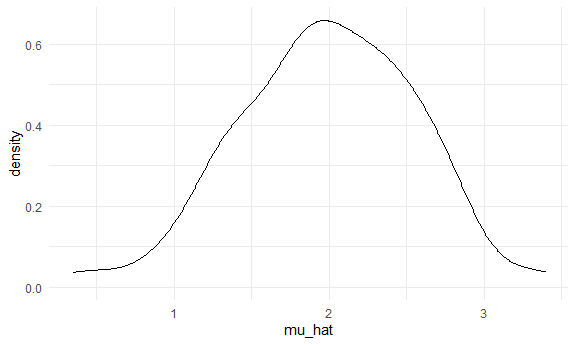
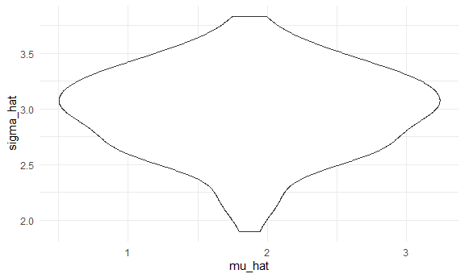
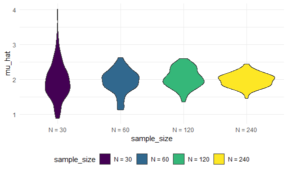
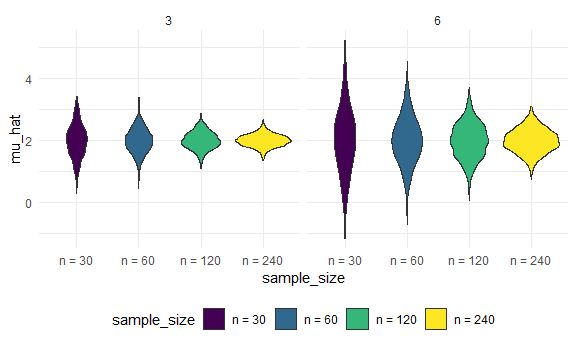

simulation
================
Jiayi Shi
2022-11-03

multiple line: alt+shift

## Simulation

Repeat: generate data, draw a sample, analysis data, return object.

``` r
sim_mean_sd = function(n, mu = 2, sigma = 3) {
  
  x = rnorm(n, mean = mu, sd = sigma)
  
  tibble(
      mu_hat = mean(x),
      sigma_hat = sd(x)
    )
}
```

``` r
output = vector("list", length = 100)

for (i in 1:100){
  output[[i]] = sim_mean_sd(n = 30)
}

bind_rows(output)
```

    ## # A tibble: 100 × 2
    ##    mu_hat sigma_hat
    ##     <dbl>     <dbl>
    ##  1   2.25      2.77
    ##  2   2.40      2.39
    ##  3   2.33      2.88
    ##  4   2.34      2.65
    ##  5   1.01      2.77
    ##  6   2.71      3.17
    ##  7   2.20      3.25
    ##  8   1.29      3.04
    ##  9   2.07      2.79
    ## 10   2.41      3.09
    ## # … with 90 more rows

## use list columns

``` r
sim_results_df = 
  expand_grid(
    sample_size = 30,
    iteration = 1:100
  ) %>% #expand_grid(...): A tibble with one column for each input in ... The output will have one row for each combination of the inputs, i.e. the size be equal to the product of the sizes of the inputs. 
  mutate(estimate_df = map(sample_size, sim_mean_sd)) %>% 
  unnest(estimate_df)
```

plot:

``` r
sim_results_df %>% 
  ggplot(aes(x = mu_hat)) +
  geom_density()
```



``` r
sim_results_df %>% 
  ggplot(aes(x = mu_hat, y = sigma_hat)) +
  geom_violin()
```



## change the sample size

``` r
sim_results_df = 
  expand_grid(
    sample_size = c(30,60,120,240),
    iteration = 1:100
  ) %>% 
  mutate(estimate_df = map(sample_size, sim_mean_sd)) %>% 
  unnest(estimate_df)
```

``` r
sim_results_df %>% 
  mutate(sample_size = str_c("N = ", sample_size),
         sample_size = fct_inorder(sample_size)) %>% #fct_inorder()
  ggplot(aes(x = sample_size, y = mu_hat))+
  geom_violin(aes(fill = sample_size))
```



``` r
sim_results_df %>% 
  mutate(sample_size = str_c("N = ", sample_size),
         sample_size = fct_inorder(sample_size)) %>% # fct_inorder: order as originally defined, otherwisw order in alphabate
  group_by(sample_size) %>% 
  summarise(emp_st_err = sd(mu_hat))
```

    ## # A tibble: 4 × 2
    ##   sample_size emp_st_err
    ##   <fct>            <dbl>
    ## 1 N = 30           0.524
    ## 2 N = 60           0.330
    ## 3 N = 120          0.276
    ## 4 N = 240          0.191

``` r
sim_results_df %>% 
  pivot_longer(
    mu_hat:sigma_hat,
    names_to = "parameter",
    values_to = "estimate"
  ) %>% 
  group_by(sample_size) %>% 
  summarize(
    emp_mean = mean(estimate),
    emp_var = var(estimate)) %>% 
  knitr::kable(digits = 3)
```

| sample_size | emp_mean | emp_var |
|------------:|---------:|--------:|
|          30 |    2.484 |   0.502 |
|          60 |    2.440 |   0.330 |
|         120 |    2.517 |   0.283 |
|         240 |    2.505 |   0.305 |

``` r
sim_results_df = 
  expand_grid(
    sample_size = c(30,60,120,240),
    true_sigma = c(6,3),
    iteration = 1:1000
  ) %>% 
  mutate(estimate_df = 
           map2(.x = sample_size, .y = true_sigma, ~sim_mean_sd(n = .x, sigma = .y))) %>% # specify clearly for 2 arguments
  unnest(estimate_df)
```

``` r
sim_results_df %>% 
  mutate(
    sample_size = str_c("n = ", sample_size),
    sample_size = fct_inorder(sample_size)) %>% 
  ggplot(aes(x = sample_size, y = mu_hat, fill = sample_size)) + 
  geom_violin() + 
  facet_grid(. ~ true_sigma)
```



## rerun

When inputs in function don’t change: rerun(n_run, func)

``` r
sim_results_df = 
  tibble(sample_size = c(30, 60, 120, 240)) %>% 
  mutate(
    output_lists = map(.x = sample_size, ~rerun(1000, sim_mean_sd(n = .x))),
    estimate_dfs = map(output_lists, bind_rows)) %>% 
  select(-output_lists) %>% 
  unnest(estimate_dfs)
```
